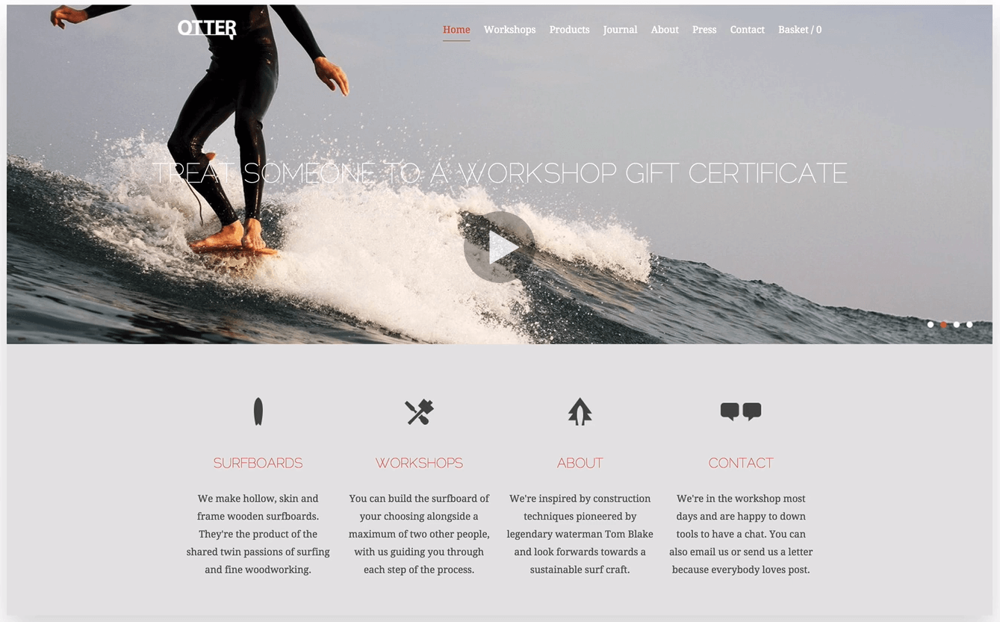
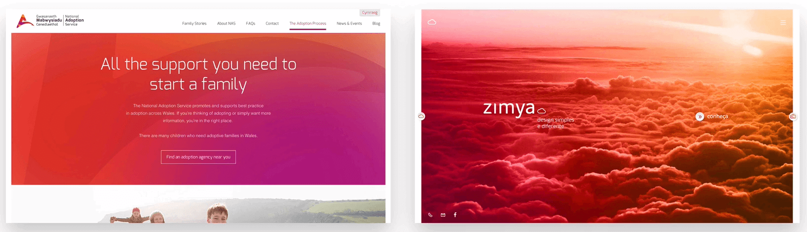
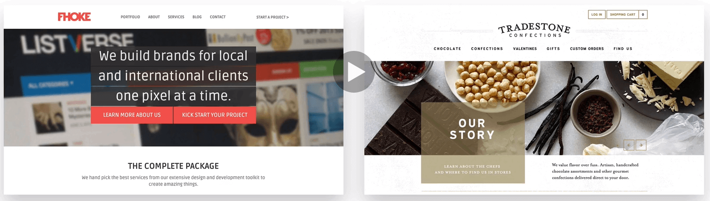
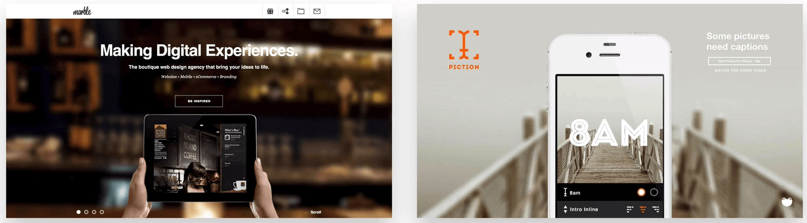
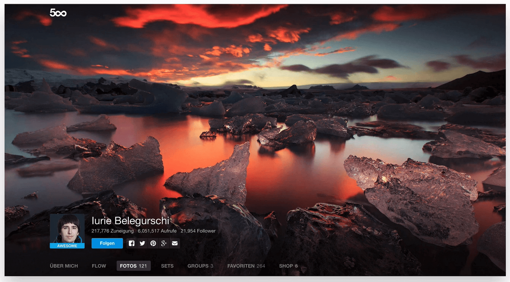

# IMAGES

## 1. Put text directly on the image

Only works if the image is quite dark and the text is bright. This method is not
encouraged if you don't konw what you are doing.

## 2. Overlay the image with a color

- Common is black, but can be use other colors that fit in the design.
  
- Also can use color gradients
  
  
- keep in mind to not use random colors
  

## 3. Put yout text in a box

- Easy way to make your text stands out and easy to read.
- The box should be opaque so that you can still see the image beneath it.
  
- You can also make the box black or go with some other color that you selected
  for your design.
  

## 4. Blur the image

- Very power and very good loocking.
  
- Either you can blur the whole image or you can use an out of focus area of a
  photo as a blur, like the first of these two web sites. The text should be
  above the blur part.
  

## 5. Floor fade

- The image suddenly fades towards black at the botton with text written over it.
  

## Some references

- Basically all free images in one place:  
  http://thestocks.im/

- Images from many sources:  
  http://www.pexels.com/

- Unsplash, a must see:  
  https://unsplash.com/

- Food images:  
  http://foodiesfeed.com/

- A curated collection of free resources:  
  http://www.imcreator.com/free

- Huge pattern library:  
  http://thepatternlibrary.com/

- Subtle patterns:  
  http://subtlepatterns.com/

- Free videos:  
  http://mazwai.com/

- Techniques for working with images in CSS:  
  http://css-tricks.com/design-considerations-text-images/
