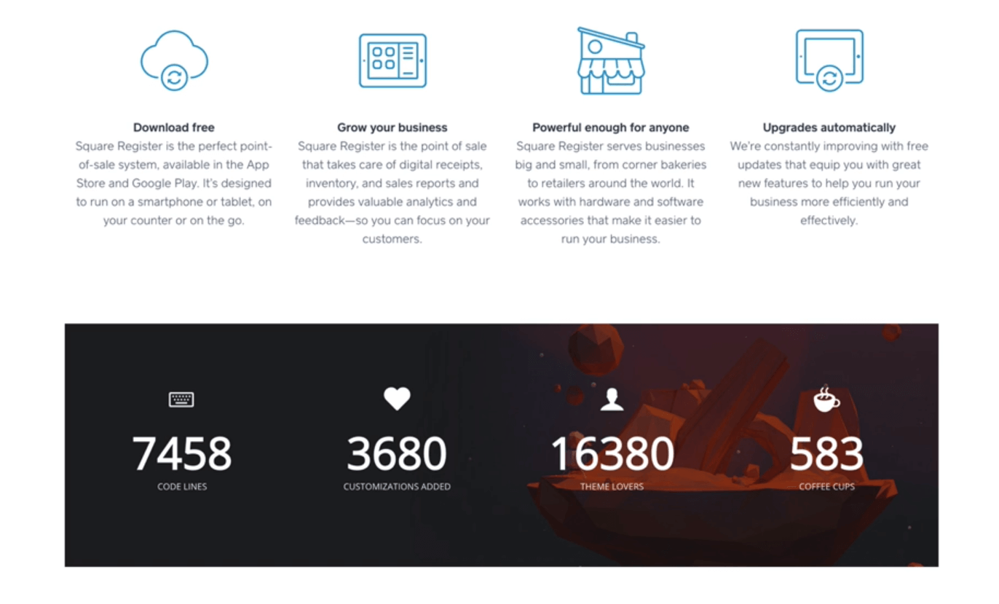
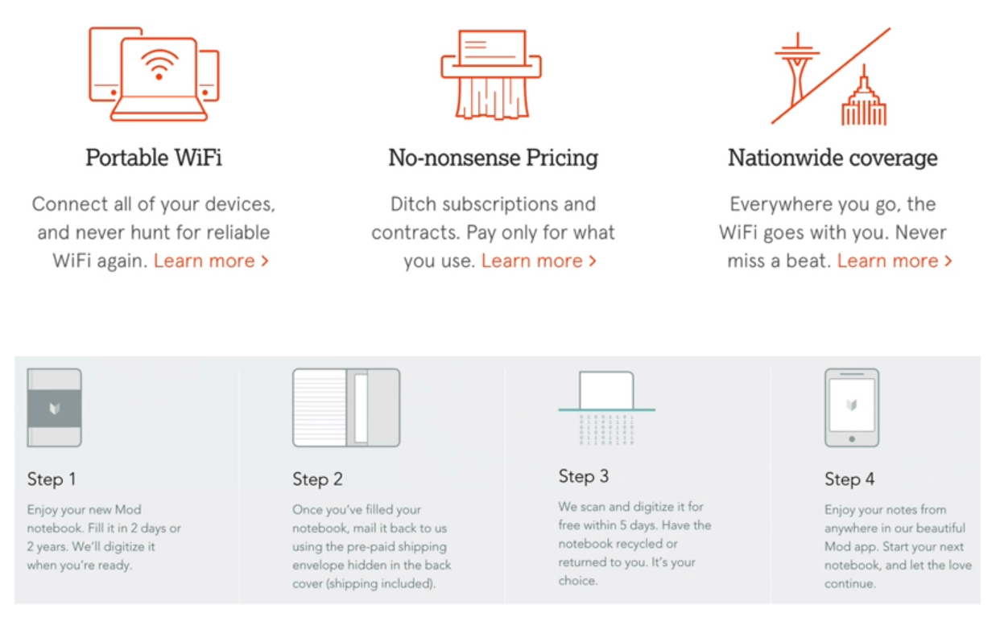
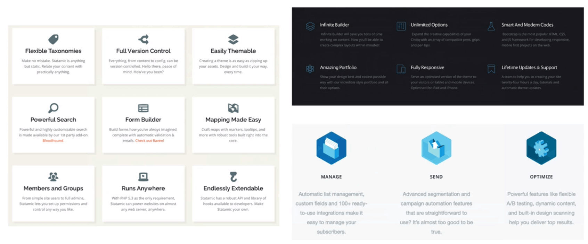
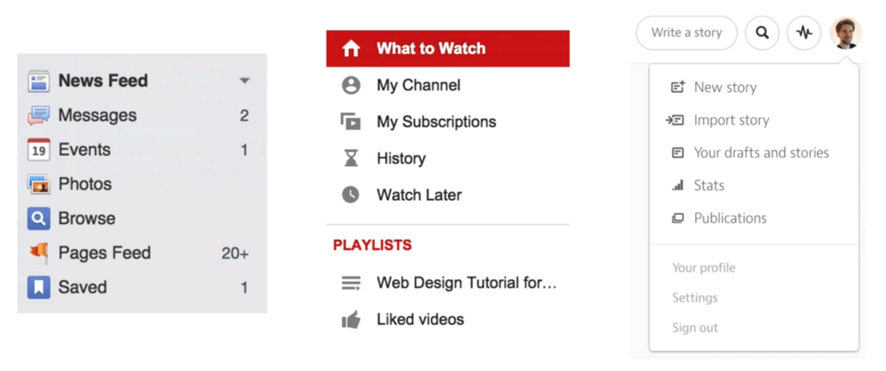
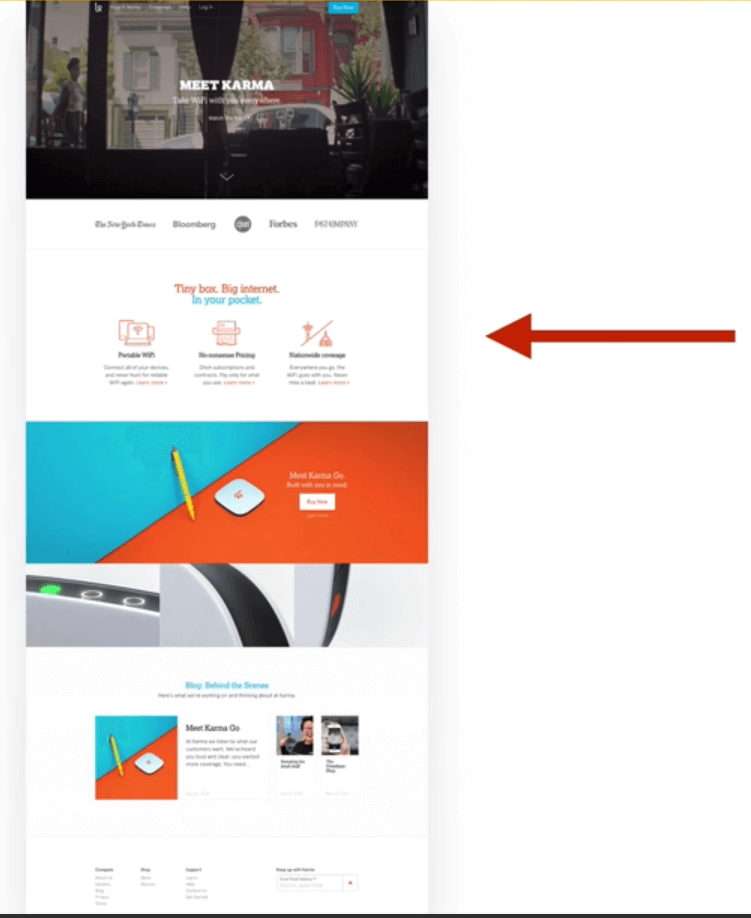
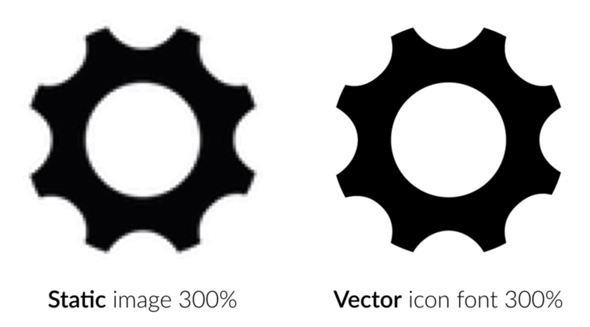

# ICONS

Icons can be a very important part of a webdesigner work.

- Improve the aesthetics of a website.
- Can provide a better user experience if well used.

  

- But icons can also cause user confusion when pourly used.

## 1. Use icons to list features / steps

## 2. Use icons for actions and links

- Should be recognizable
- Label your icons if there is enought space
  

## 3. Icons `should NOT` take a center stage

Icons should play a supporting rule. Don't cover your site with icons everywhere.

## 4. Use icon fonts (vector, not images) to keep good resolutions

## Some references

- Beautiful icon font:  
  http://ionicons.com/

- Another beautiful icon set:  
  http://entypo.com/

- Font awesome icons:  
  http://fontawesome.io/icons/

- Big collection of SVG fonts:  
  http://iconmonstr.com/

- Yet another icon font:  
  http://icon-works.com/
