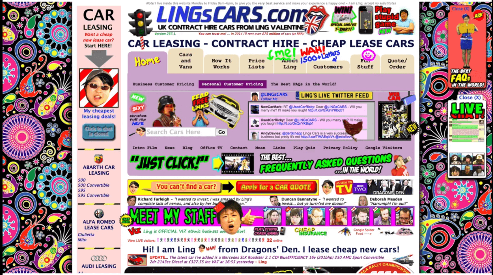
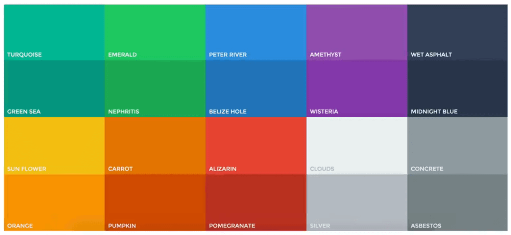
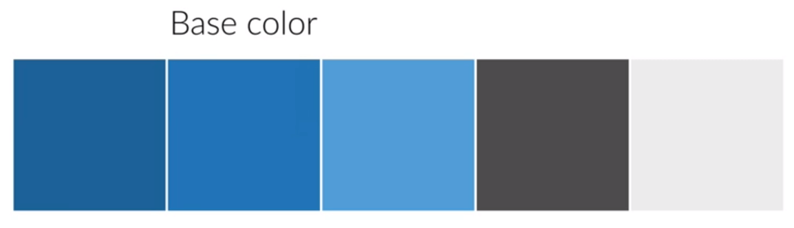
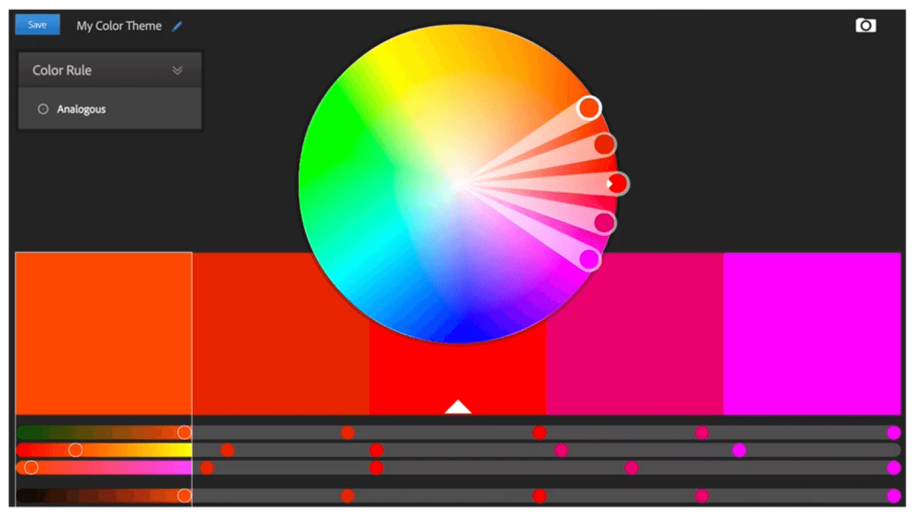

[<-- Back to README](../README.md)

# COLORS

Color is probably the most complicated area of user interface design. This is because we have the tendency to use colors that distract and feel completely unnatural.
That can make our design look very messy.

Here is an example:

## 1. Use only one base color

- Create your pallets of colors

  

  The gray tones are not considered based color here, but we usually will need them for instance for text and background colors.

## 2. Use a tool if you want to use more colors

Use tools to help you on that (eg. `Adobe Color CC` or `Palleton`). This tools make use of color theory to choose the best color combinations for you.

## 3. Use color to draw attention

Use a main color to draw attentions to the most important elements of your website

Attention: When you are in doubt about using colors and don't know where to use colors and how often, just pick a color and it stands out and use it mostly to draw attention to a button or any other element of importance on your web site. For example, this uber website.

## 4. Never use black in your design

This is because black actually almost never appears in the real world. Using complete black doen't fell natural.

## 5. Choose colors wisely

### The Meaning Of Colors In Web Design

Picking a color for a website means more than picking your favorite color and turning it into a design.  
It means picking the right color in order to `get the desired response from your audience`.  
Color really makes a difference, because there are psychological effects behind each color.

  

- Red is a great color to use when power, passion, strength and excitement want to be transmitted. Brighter tones are more energetic and darker shades are more powerful and elegant.
  

  

- Orange draws attention without being as overpowering as red. It means cheerfulness and creativity. Orange can be associated with friendliness, confidence, and courage.
  

  

- Yellow is energetic and gives the feeling of happiness and liveliness. Also, it associates with curiosity, intelligence, brightness, etc.
  

  

- Green is the color of harmony, nature, life and health. Also, it is often associated with money. In design, green can have a balancing and harmonizing effect.
  

  

- Blue means patience, peace, trustworthiness, and stability. It is one of the most beloved colors, especially by men. It is associated with professionalism, trust and honor. That's actually why the biggest social networks use blue.
  

  

- Purple is traditionally associated with power, nobility and wealth. In your design, purple can give a sense of wisdom, royalty, nobility, luxury, and mystery.
  

  

- Pink expresses romance, passivity, care, peace, affection, etc.
  

  

- Brown is the color of relaxation and confidence. Brown means earthiness, nature, durability, comfort, and reliability.
  

## Some references

- Cool Flat UI colors:  
  http://flatuicolors.com/

- Even more cool colors:  
  http://getuicolors.com/

- Find variations of colors (very good):  
  http://www.0to255.com/

- Adobe Color CC, play around with colors:  
  https://color.adobe.com/create/color-wheel/

- Palettoon, play around with colors:  
  http://paletton.com

- Beautiful gradients for webdesign:  
  http://uigradients.com/

- Learn about colors:  
  http://www.rocket-design.fr/color-template/

- Learn even more about colors:  
  http://webdesign.tutsplus.com/articles/an-introduction-to-color-theory-for-web-designers--webdesign-1437

