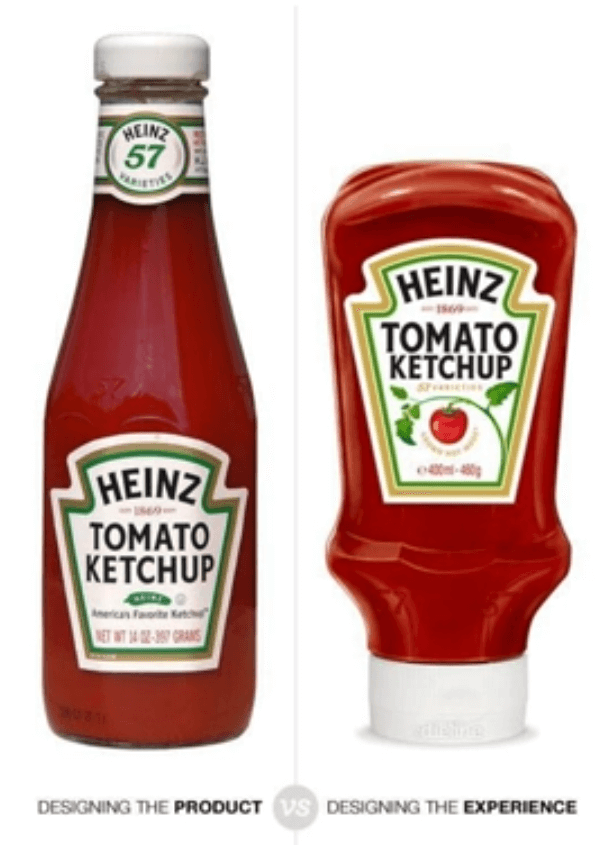
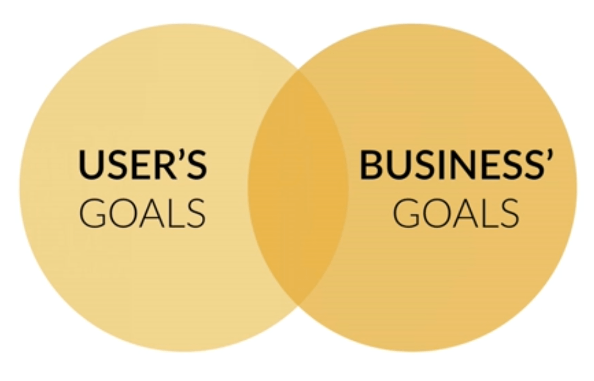

[<-- Back to README](../README.md)

# USER EXPERIENCE

`User interface` is the presentation of a product, how it looks and feels.

`User experience` is the overall experience the user has with a product. It includes the user interface but also undestands the whole picture of the product.

_"It's not just what it looks lije and feels like. Design is how it works."_ - Steve Jobs

A good explanation of the difference between designing just the presentation of the product or designing the hole experience.

You can think the UX as the user's goals and the business' goals.  

A UX designer needs to align those goals so that the business benefits when the user reaches their goal (value of the project).

## Some references

- UX crash course in 31 days  
  http://thehipperelement.com/post/75476711614/ux-crash-course-31-fundamentals

- UI tricks that can lead to higher conversion rates:  
  http://www.goodui.org/
