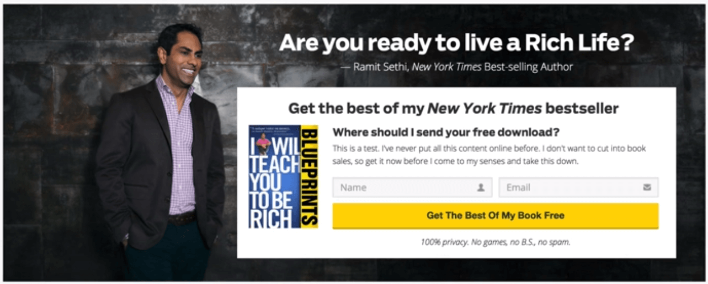
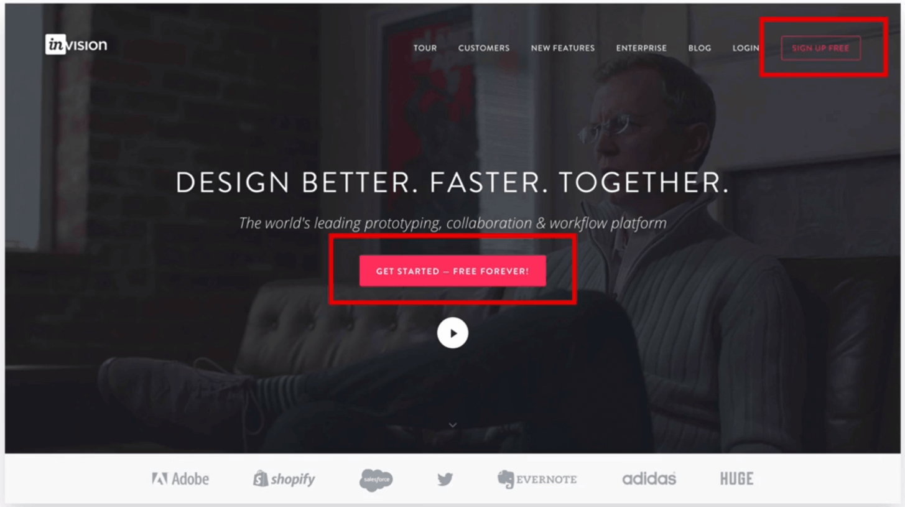
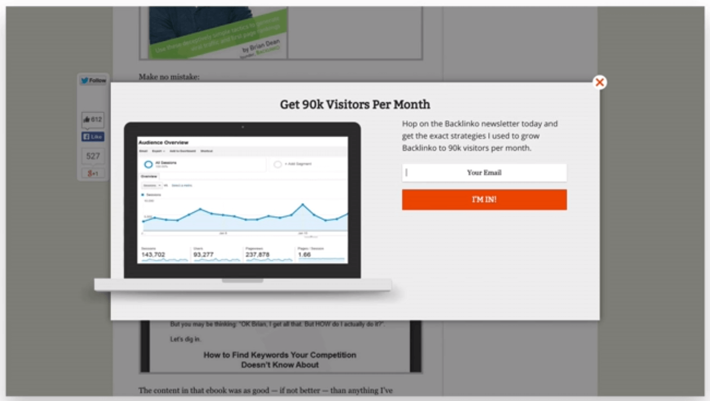
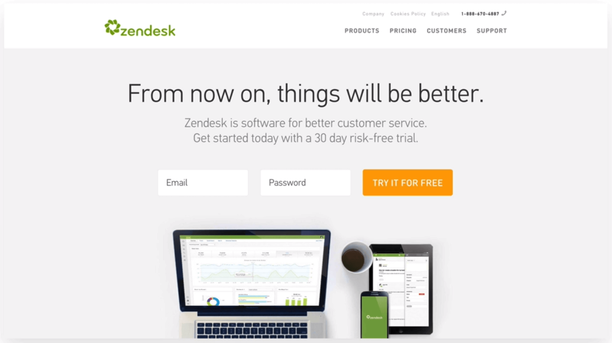
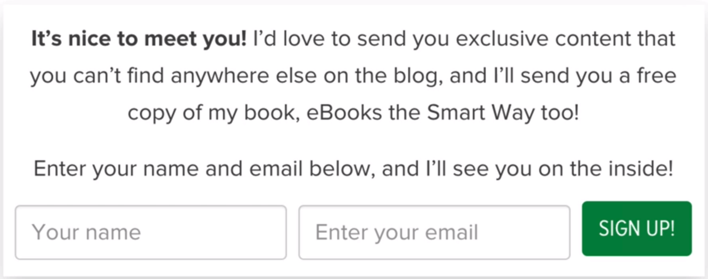
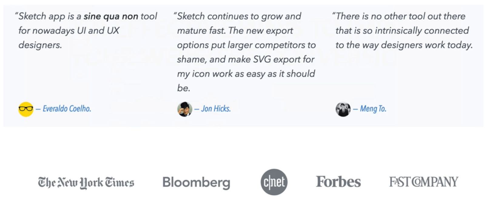
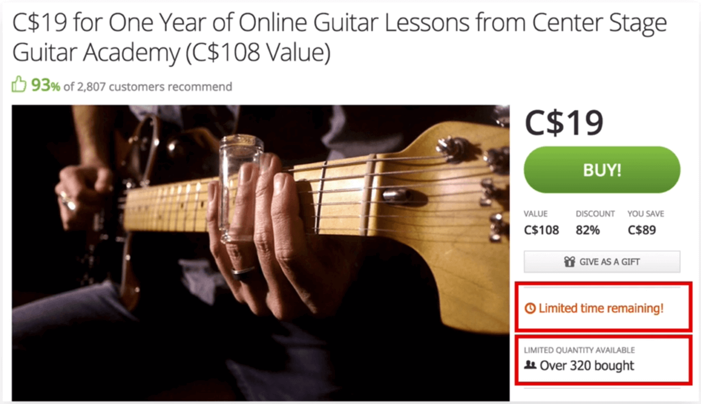
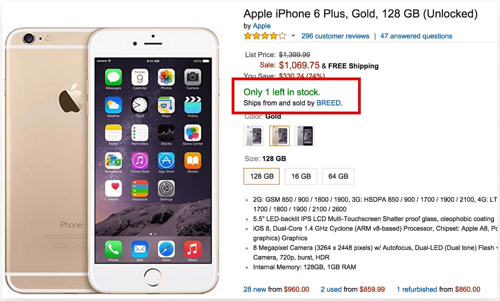

# EFFECTIVES WAYS TO IMPROVE TOU WEBSITE CONVERSION

This part is meant to you if you want to sell something on your website: maybe a
digital product like a course, or an ebook, or maybe a subscription plan...

Further than the design you can improve your website's conversion on top of that.

## 1. Built trust with your future customer

Offer your visitors a gift in order to build trust instead of trying to seld
something right away.

## 2. Repeat your primary action

You should have a strong call-to-action were you want your users to click, but instead of showing it just once you should repeat it on your website.

## 3. Grab your user's attention

popups...

## 4. Tell your user the benefit

In your call to action button you need to tell your user the benefit of clicking that button.
Instead of saying samething boring like "click here" or "sign-up" you tell the user he should `"try the service for free"`.

So **always use a word that describes the bennefits of clicking that button**

## 5. Don't ask for too much information

If you want your user to signup for anything, don't ask him for more information than you need. If you don't need `phone numbers`, `address` or whatever don't ask them for that information. The user doesn't want to go throw many fields to achieve something.

## 6. Use social proof

Social proof is a great persuation tattic that can really help you encrease convertion.

This can be done in form of costumer testimonials or showing that other companies use your product or service.

## 7. Use urgency

Other good technic is the urgency.  
Urgency is when a buyer feels that their need to act quickly, is used to make people to act now rather than later (eg.: grouppon website). Use words like `now`, `hurry`, `instant` and `immediately` in your call to action buttons in order to make your users act.

# 8. Use Scarcity

Scarcity is the feeling that the product or service is in short supply and about to run out, making the user tend to value it more.

