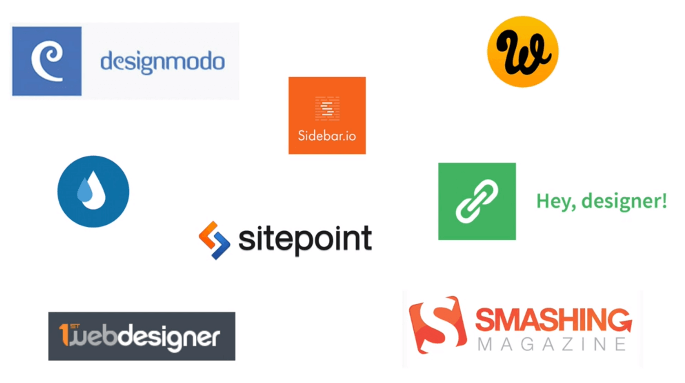

[<-- Back to README](../README.md)

# WHERE TO GO FROM HERE

- Keep up with the web industry
- Reed some webdesign blogs
- Practice, **Practice**, **PRACTICE**
- Never stop learning (HTML, CSS, JS, etc)

# EVEN MORE RESOURCES

- Huge list of front-end development resources:  
  https://github.com/dypsilon/frontend-dev-bookmarks

- Curated resources for everything creative:
  http://oozled.com/

# DIVE INTO HTML

- The best text editor for front-end web development in the world:  
  http://brackets.io/

- Complete HTML reference:  
  http://www.w3schools.com/html

- HTML special characters  
  https://css-tricks.com/snippets/html/glyphs/

# FORMATTING WITH CSS

- Complete CSS reference (this is really good):  
  http://tympanus.net/codrops/css_reference/

- Important CSS selectors:  
  http://code.tutsplus.com/tutorials/the-30-css-selectors-you-must-memorize--net-16048

- Cool things you can do with Google Chrome Developer Tools:  
  http://www.labnol.org/solware/chrome-dev-tools-tutorial/28131/

# THE KILLER WEBSITE PROJECT

## 7 REAL-WORLD STEPS TO A FUNCTIONAL WEBSITE

1. Define your project (goal and audience)
2. Plan out everything
3. Sketch your ideas before you start designing
4. Design and develop your website with HTML and CSS
5. It’s not done yet: optimization
6. Launch the masterpiece
7. Site maintenance

Periodic table of web design process:  
http://www.newdesigngroup.ca/blog/web-design-process-infographic/

# LINKS USED IN OUR PROJECT

- Free, simple and easy-to-use fluid grid:  
  http://www.responsivegridsystem.com/

- Get random user profiles:  
  http://randomuser.me/

- Subtle hover effects:  
  http://tympanus.net/codrops/2014/06/19/ideas-for-subtle-hover-effects/

- Up-to-date browser support tables for CSS and HTML:  
  http://caniuse.com/

- Using Internet Explorer on a Mac  
  https://www.modern.ie

- Social network colors:  
  http://designpieces.com/2012/12/social-media-colours-hex-and-rgb/

# LET’S ADD SOME COOL EFFECTS

## LINKS USED IN THE COURSE

- Animate.css:  
  http://daneden.github.io/animate.css/

# COOL JQUERY PLUGINS

- Webappers, huge list of plugins:  
  http://www.webappers.com/category/components/tool.ps/

- jQuery Rain, another huge list of plugins:  
  http://www.jqueryrain.com/

- Magnific popup:  
  http://dimsemenov.com/plugins/magnific-popup/

- Tool.pster:  
  http://iamceege.github.io/tool.pster/#demos

- Maplace.js, google maps plugin:  
  http://maplacejs.com/

- Typer, a plugin that types:  
  http://cosmos.layervault.com/typer-js.html

- OnePageScroll:  
  http://www.thepetedesign.com/demos/onepage_scroll_demo.html

# OPTIMIZING AND LAUNCHING OUR WEBSITE

- Favicon Generator:  
  http://realfavicongenerator.net/

- Compress images:  
  http://optimizilla.com/

- Minify CSS code:  
  http://www.minifycss.com/css-compressor/

- Minify JavaScript code:  
  http://www.minifyjavascript.com/

- HTML validation:  
  http://validator.w3.org/

- Preview your website on mul.ple mobile devices at once:  
  http://www.responsinator.com/

- SEO checklist:  
  http://webdesign.tutsplus.com/articles/a-web-designers-seo-checklist-including-portable-formats--webdesign-10740

- Google analy.cs  
  http://www.google.com/analy.cs/

# KEEPING UP WITH THE WEB INDUSTRY

- Treehouse show, weekly video about new things in webdesign and development:  
  http://teamtreehouse.com/library/the-treehouse-show

- Sidebar: the 5 best design links, every day:  
  http://sidebar.io/

- Codrops, webdesign blog with lots of freebies:  
  http://tympanus.net/codrops/

- Webdesignerdepot, webdesign blog:  
  http://www.webdesignerdepot.com/

- Smashing magazine, webdesign blog:  
  http://www.smashingmagazine.com/

- 1st webdesigner, webdesign blog:  
  http://www.1stwebdesigner.com/

- Hey designer, curated list of webdesign articles:  
  http://heydesigner.com/

- Sitepoint, learn HTML, CSS and more:  
  http://www.sitepoint.com/
